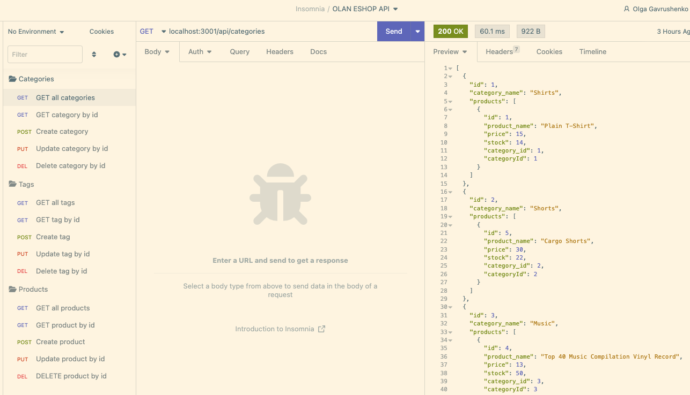

  # OLAN ESHOP API

  

  ## Description
  
  This a backend application, provide api for e-commerce typical applications, support CRUD operations for categories, products and tags entities.

  

  ## Table of Contents
 
  - [Installation](#installation)
  - [Usage](#usage)
  - [Credits](#credits)
  - [License](#license)
  - [Questions](#questions)
  - [Contribution](#contribution)
  - [Tests](#tests)
    
  ## Installation
  
  1. Update environment variables: `.env`
  2. install dependencies `npm install`
  3. create db from `db\schema.sql` 
  *** optional: you may seed DB with example data: `node seeds`
  4. run application `node server.js`

    Note:
    - if you observe the connection error, check the version of `node`. It was developed and tested with `node version 16.18.1`
    - connection details should be updated: 
      - rename `.env.EXAMPLE` to `.env`
      - Update user-specific data:        
        {
          host: "localhost",
          user: "root",
          password: "",
          ...
        }

  ## Usage
  
  Implemented api GET all, GET by id, POST, PUT, DELETE for category, product and tag entities

  As a reference you may import Insomnia collection from `assets/json/Insomnia_2022-12-15.json`

  Video walkthrough: https://drive.google.com/file/d/1j_FWXJGkjxE2K7cynx9ONhZR1NQok97Q/view
  
  
  ## Credits
  
  - Olga Gavrushenko 
  - Learning materials [Berkley Extension: coding bootcamp](https://extension.berkeley.edu/) 
  - Instructor: Robert Wijtman
  
  ## License
  
  

  This application is available under the license: None. 
    See the LICENSE file for more info. Full details available by link . 
    
 
  ## Questions
  
  Link to my GitHub profile https://github.com/olgagav/
  
  If you have additional questions or proposals please email me: [ogavby@gmail.com](mailto:ogavby@gmail.com?subject=[GitHub]%20command-line%20password%20generator)
    
  ## Contribution

  Contributions are what make the open source community such an amazing place to learn, inspire, and create. Any contributions you make are greatly appreciated.
  
  - Fork the Project  
  - Create your Feature Branch   
  - Commit your Changes   
  - Push to the Branch   
  - Open Pull Request
  
  ## Tests
  
  n/a
  